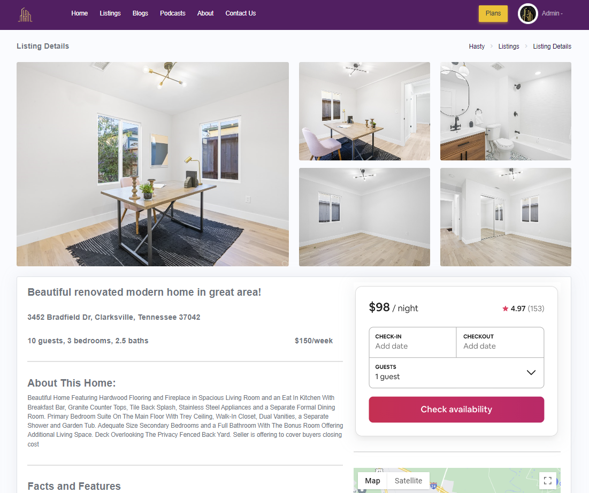
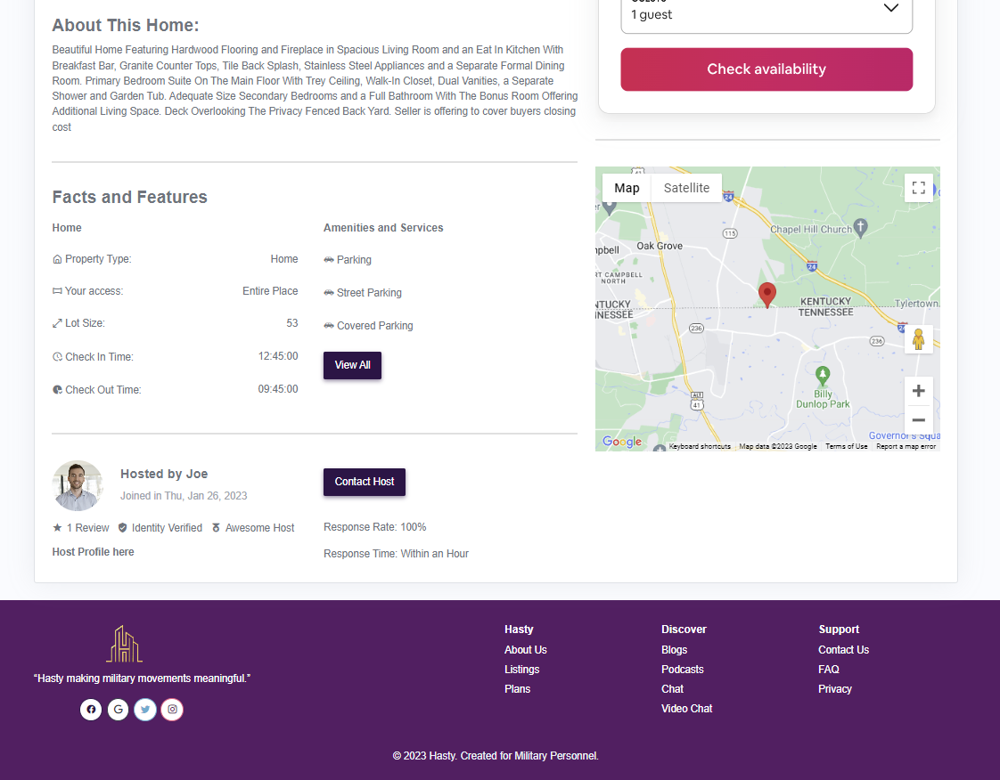
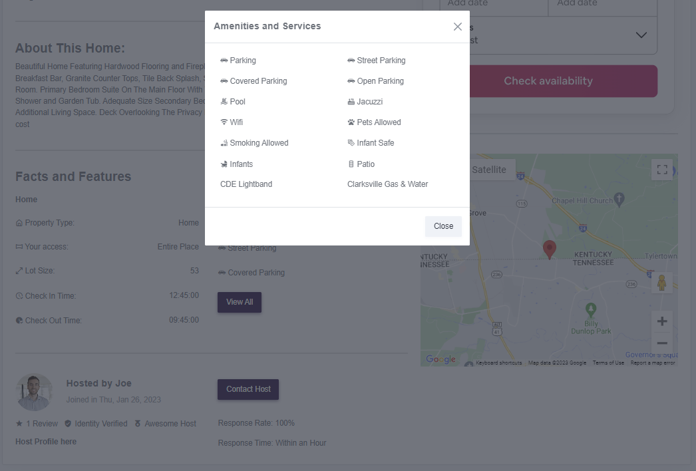
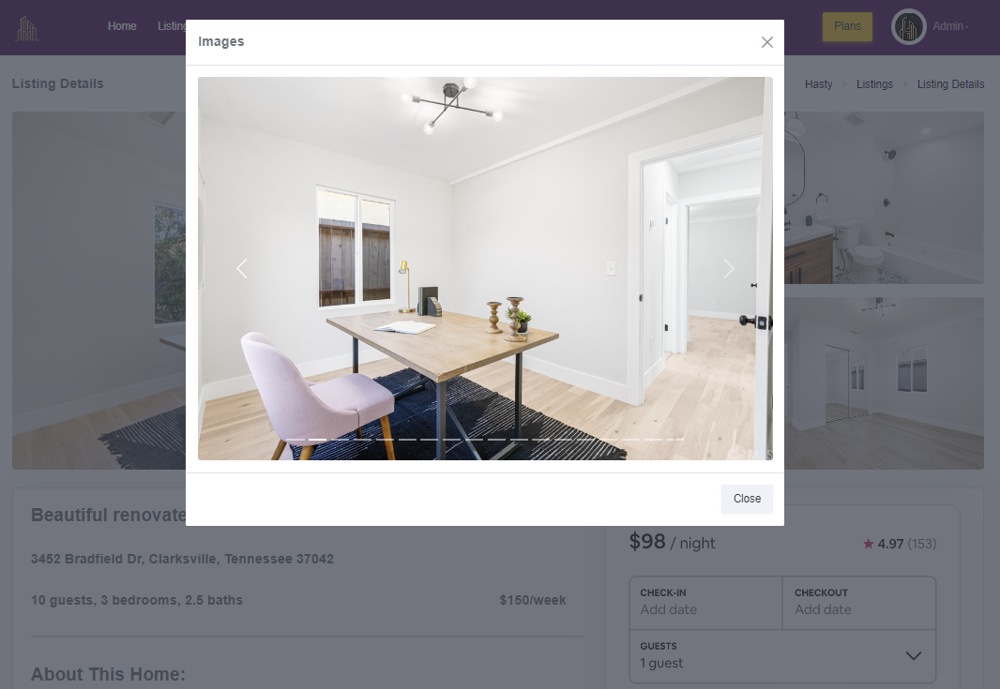

# Hasty Features

This repo is a collection of some of my work for the startup Hasty, a platform/project I am working on through my coding bootcamp.

For Hasty, we are building a military-friendly platform that helps servicemembers and their families more seamlessly make their duty station move, which can be very stressful since you have to uproot so often. Hasty's listings will help match servicemembers with housing depending on their rank, duty station, and family situation.

---

### Listing Details Front End

The primary component I've worked on is the ListingDetails.jsx page. This page is the primary listing page you would go to if you were looking at information for a house/listing much like you would on Airbnb or Redfin, etc.

Here are some of the functionality highlights:

- Image Modal with Carousel
- Public Url coded for quick/easy access
- Mapping and Switch functions for Images, Services, and Amenities w/ State management
- Icons for Amenities and Services
- Google Maps API
- Amenities/Services Modal

---

- Image Modal with Carousel

  I wanted a way to quickly load images once clicked on so I built a modal to display them that pops up. This optimizes performance and reduces the number of calls to the database. Originally I had built another component specifically for Images that (when you click on any image) would pull all the images again from the database and render them on a new page, but this slowed down performance when I really didn't need to be doing it in the first place.

  In the modal, I wanted an easy way for users to scroll through images, so I built an image carousel with arrows on the sides and a bottom index component. Left and Right keyboard arrows can also be used to navigate.

- Public Url coded for quick/easy access

  I wanted a user to be able to go directly to the listing page, so the Url is coded using the ListingId that I am grabbing using 'useParams' from React Router. This way users can easily share the Url with others to look at a listing. Eventually, there will be two paths to get to the listing page - one from clicking on a Listing 'card' from a multitude of listings/cards, and the other directly from the Url.

- Mapping and Switch functions for Images, Services, and Amenities w/ State management

  My database returns a lot of properties for a listing to include JSON objects for amenities, services, and images. I am using mapping functions to map these objects to their own arrays in my State.
  I am mapping Images into a format useable for my image Carousel to include some changes to its HTML.

- Icons for Amenities and Services

  I want to display icons next to certain Amenities or Services (like a hot tub icon for jacuzzi amenity or a car for parking), so I am using 'Switch' functionality to be able to match the AmenityId and service to its appropriate icon.

- Google Maps API

  I incorporate the Google Maps API because it's always nice to see where the listing actually is on a map. I want to know where I'm living and what else is around me. I'd say pretty standard for any type of housing or listing service.

- Amenities/Services Modal

  Things like Amenities and Services are very variable - one house may have only 5 while another has 40. Originally I built a 'Show More' button to collapse extra Amenities and Services so that they don't all need to display immediately on the page. Later on, I built another modal that includes the amenity or service icon to replace the 'Show More' button. I think it looks a lot cleaner and doesn't mess with the rest of the page like if I was expanding or collapsing using the button.

---

I've included a screen recording at the below link to show some of the current functionality (as of 20 Feb 2023).

https://www.loom.com/share/15d838f289764ca993ef01c0426d9796

---

Listing Details Main Page:

Amenities Modal with Icons:

Images Modal with Carousel:

